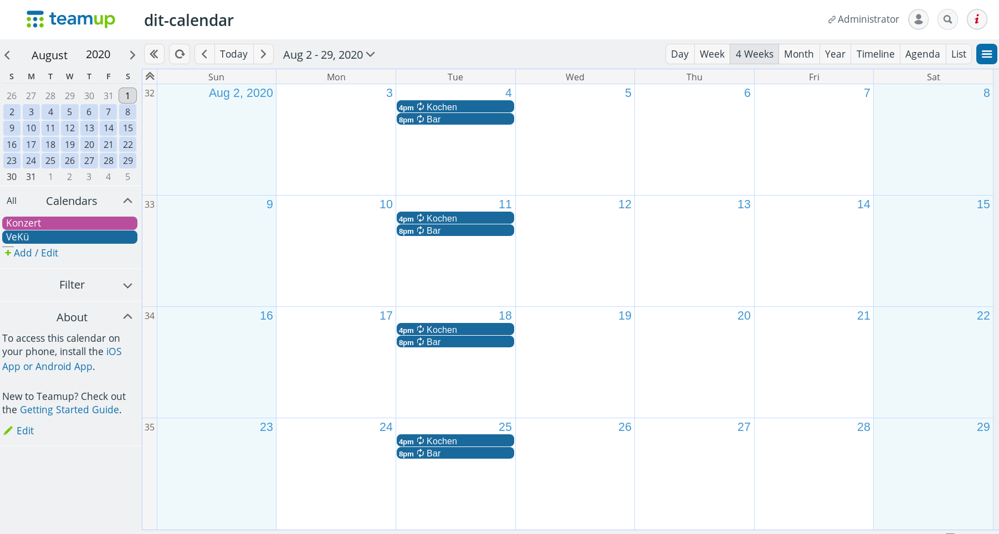

# teamup-telegram-bot 

This bot lets you post events (tasks or room bookings) from the the [teamup calendar](https://www.teamup.com/) into a [telegram](https://telegram.org/) chat group, so people can sign up for them. It's designed to help (public/collective/participatory/collaborative) groups to organize work.

> :octocat: Alternatively, [other calendars](https://github.com/dit-calendar/dit-calendar.github.io) are also supported.

after you created an event in your teamup calendar

post it in your telegram group/channel, so a person can assign hirself

# how to use
To use this application in your telegram group, you must first complete following steps:
1. create a calendar on [teamup](https://www.teamup.com/)
2. create a telegram Bot
   * start a conversation with [@Botfather](https://t.me/botfather) and write `/newbot`
   * give your Bot a name, maybe a nice picture and **please mention this website in your Bot description**
3. start the program for your telegram Bot by clicking on
     _(you need an account but it's free)_
   * it will build&start the program from the current source code
4. invite the new Bot to a telegram group/channel and post `/postcalendar CalendarName Date` e.g. `/postcalendar VeKü 2020-08-26`

**This application is in beta** and will be further developed after some [feedback](https://github.com/dit-calendar/teamup-telegram-bot/issues) from you.

### how to update
After this program is deployed to heroku **it will not be updated automatically!** If you are interested in more features, you should check out [new releases](https://github.com/dit-calendar/teamup-telegram-bot/releases) from time to time.

To update your bot manually, you have to delete the program in heroku (under settings) and click on the heroku deploy button from step 3. again. Unfortunately this will cause data loss at the moment (but only usernames). To avoid problems you have to click on the reload button in your telegram group of each still relevant calendar or repost them again.

# for developers

start the DB with `docker-compose up`

## manual deployment
* `gradle build`
* `heroku deploy:jar build/libs/teamup-telegram-bot*-all.jar --app teamup-telegram-bot`

## manual test
* https://core.telegram.org/bots/webhooks
* check bot status `https://api.telegram.org/bot{token}/getWebhookInfo`
* send message manually
 `curl -v -k -X POST -H "Content-Type: application/json" -H "Cache-Control: no-cache"  -d '{
 "update_id":10000,
 "message":{
   "date":1441645532,
   "chat":{
      "last_name":"Test Lastname",
      "id":1111111,
      "first_name":"Test",
      "username":"Test"
   },
   "message_id":1365,
   "from":{
      "last_name":"Test Lastname",
      "id":1111111,
      "first_name":"Test",
      "username":"Test"
   },
   "text":"/start"
 }
 }' "localhost:8443/"`
